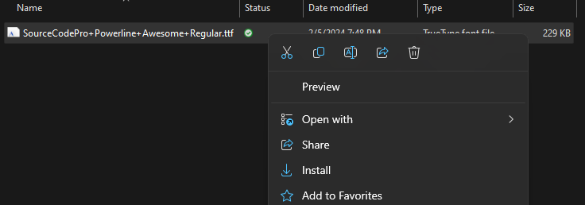
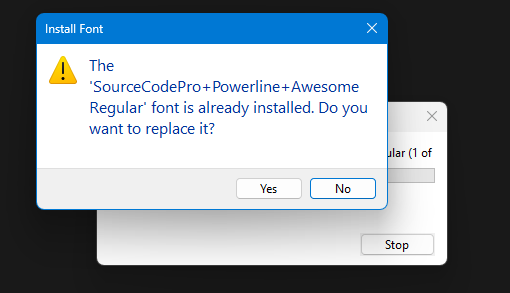
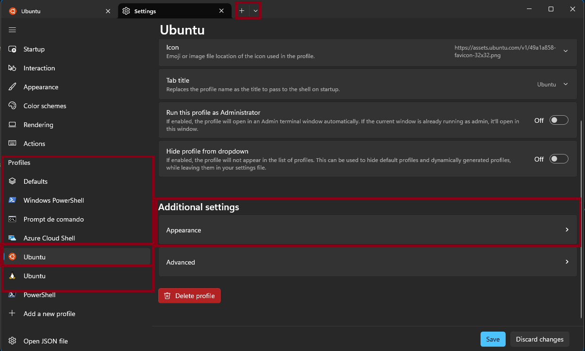
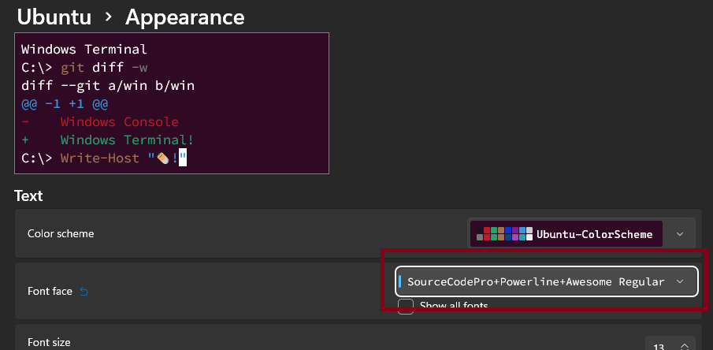
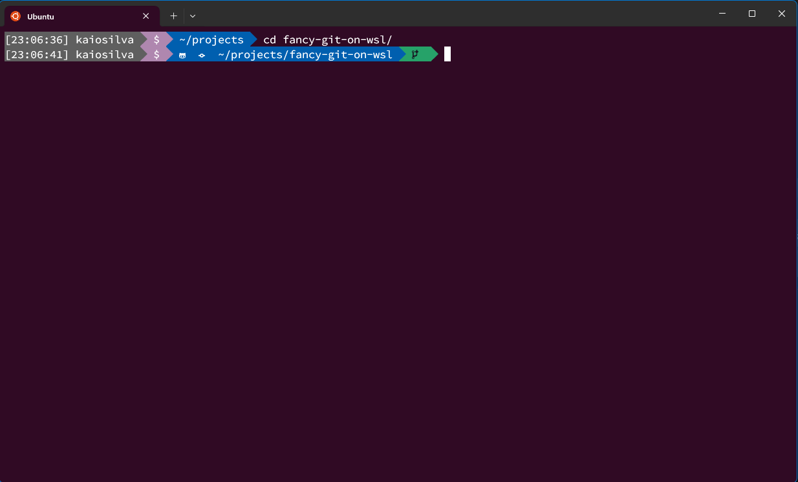
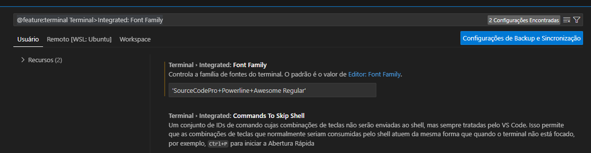

# fancy-git-on-wsl

Este guia fornece um passo a passo para instalar o Fancy-Git em seu sistema Windows no ambiente WSL Ubuntu.

## Instalação do Fancy-Git no Linux

Execute os seguintes comandos no terminal para instalar o Fancy-Git no seu sistema Linux:

### Passo 1: Instalar o pacote FontConfig

Use o seguinte comando:

```bash
sudo apt update
sudo apt install fontconfig
```

### Passo 2: Rodar o script de instalação do Fancy-Git

#### Instalação

```bash
curl -sS https://raw.githubusercontent.com/diogocavilha/fancy-git/master/install.sh | sh
```

Consulte a documentação oficial do [Fancy Git](https://github.com/diogocavilha/fancy-git), para demais informações.

### Passo 3: Instalando a fonte SourceCodePro+Powerline+Awesome+Regular

O Windows/WSL/Ubuntu não possui compatibilidade com as fontes presentes no repositório do fancy-git, então vamos instalar uma fonte alternativa que é compativel.

Instale a fonte no windows, lembre-se o windows que está rendezirando os caracteres na tela.

Basta clica com o direito na fonte ´SourceCodePro+Powerline+Awesome+Regular.ttf´ e selecionar instalar.



E então clica em sim.  



> Originalmente baixei a fonte ´SourceCodePro+Powerline+Awesome+Regular.ttf´ deste repositório [Falkor/dotfiles](https://github.com/Falkor/dotfiles/blob/master/fonts/SourceCodePro%2BPowerline%2BAwesome%2BRegular.ttf)

### Passo 4: Configurar o Windows Terminal

Abra o Windows Terminal > Settings > Profiles > Ubuntu > Aparence



Selecione a fonte SourceCodePro+Powerline+Awesome Regular




### Passo 5: Reinice o Windows Terminal

It's Done!!!



### Opcional: Configurar o terminal padrão do VSCode

- Abra as configurações do Vscode usando o atalho `ctrl+,`
- Na barra de pesquisa cole:
    ```
    @feature:terminal Terminal>Integrated: Font Family
    ```
- Digite a fonte `'SourceCodePro+Powerline+Awesome Regular'`

